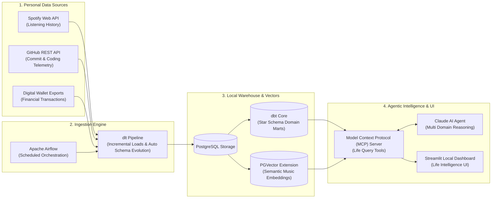

# LifeBase 🔭
> A personal data warehouse that turns fragmented life data (music, coding, spending) into one queryable source of truth with an autonomous AI agent on top.

---

## 🌟 Why This Exists

My personal data lives across multiple disconnected applications: Spotify for music, GitHub for engineering output, and digital wallets for daily financial transactions. None of these platforms communicate with each other.

**LifeBase** unifies these disparate data streams locally into a single cohesive data warehouse. It enforces 100% data privacy by keeping the entire pipeline on premise, ensuring zero data exposure to third party cloud servers while complying with Personal Data Protection (PDP) principles.

---

## 🏗️ Architecture Diagram



---

## 📊 Key Results & System Metrics

| Metric | Specification & Value |
| :--- | :--- |
| **Sources Unified** | 3 Distinct Domains (Spotify, GitHub, Digital Wallets) |
| **Ingestion Engine** | Incremental loading via **`dlt`** with automated schema evolution |
| **Data Warehouse** | PostgreSQL with **`dbt`** dimensional star schema modeling |
| **Semantic Search** | 384 dimensional dense embeddings powered by **`PGVector`** |
| **Agentic Protocol** | **Model Context Protocol (MCP)** exposing structured query tools |
| **Privacy & Security** | 100% Local Deployment via Docker Compose (Zero Cloud Leakage) |

---

## 🧠 Design Decisions Worth Asking About

### 1. Why `dlt` instead of manual Python scripts?
* **Automated Schema Evolution:** APIs frequently change payload structures. `dlt` detects new fields dynamically and adapts the PostgreSQL destination schema without breaking pipelines.
* **Built in Incremental State:** Tracks historical sync cursors out of the box, ensuring only new listening events and commits are fetched.

### 2. Why PostgreSQL instead of a Cloud Lakehouse (Databricks / Snowflake)?
* **Scale Honesty:** Personal telemetry data operates in Megabytes to Gigabytes, not Terabytes. Using PostgreSQL eliminates cloud subscription costs and network latency while delivering sub 10ms query execution.

### 3. Why Local Only Deployment?
* **PDP Law Awareness & Privacy:** Financial spending records and daily habit logs represent sensitive personal data. Containerizing the stack locally via Docker Compose ensures complete data sovereignty with zero external leakage.

---

## 🚀 Data Modeling: Star Schema Marts

LifeBase organizes transformed data into Kimball dimensional marts inside PostgreSQL:

* `fact_listening_events` ➔ `dim_tracks`, `dim_artists`, `dim_time`
* `fact_coding_activity` ➔ `dim_repositories`, `dim_languages`, `dim_dates`
* `fact_financial_transactions` ➔ `dim_merchants`, `dim_categories`, `dim_accounts`

These marts enable cross domain analytical queries, such as correlating late night coding sprints with electronic music listening patterns and coffee expenditures.

---

## ⚡ Quickstart (Local Run via Docker Compose)

```bash
# 1. Clone the repository
git clone https://github.com/Wardlexy/lifebase.git
cd lifebase

# 2. Configure environment variables
cp .env.example .env

# 3. Spin up PostgreSQL, dbt, Airflow, and Streamlit
docker compose up -d

# 4. Access the Local Streamlit Life Intelligence Dashboard
# Open http://localhost:8501 in your browser
```

---

## 🗺️ Limitations & Future Roadmap

* [ ] **Automated Bank Ingestion:** Transition from manual digital wallet CSV exports to direct Open Banking API webhooks.
* [ ] **Health & Wearable Integration:** Ingest Apple HealthKit XML telemetry (sleep duration, heart rate, step count).
* [ ] **Local LLM Offline Mode:** Integrate Ollama for zero internet agentic reasoning.
